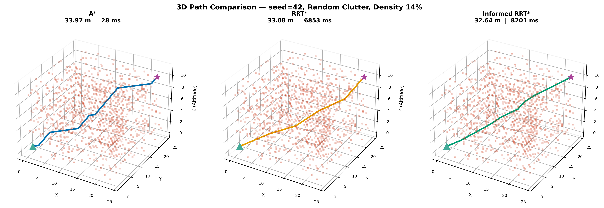
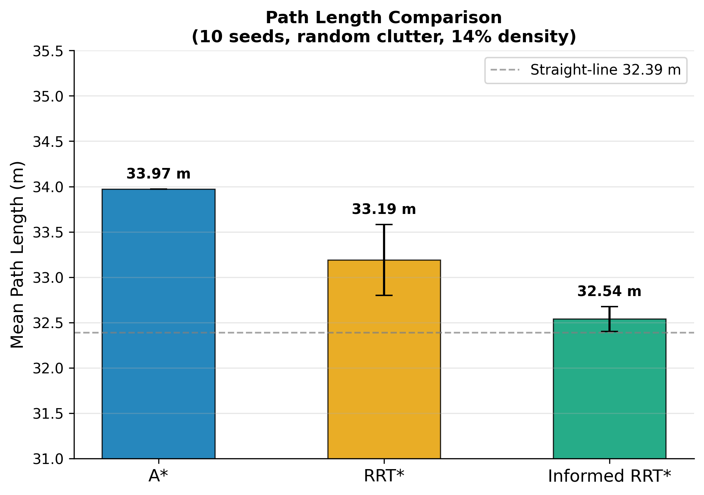
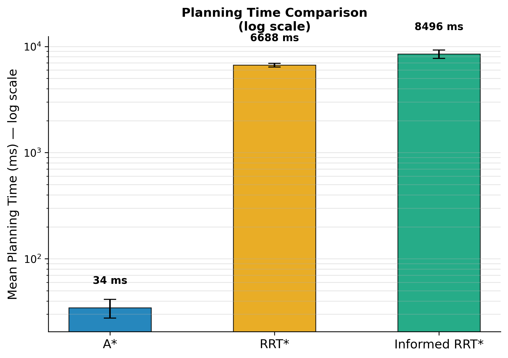
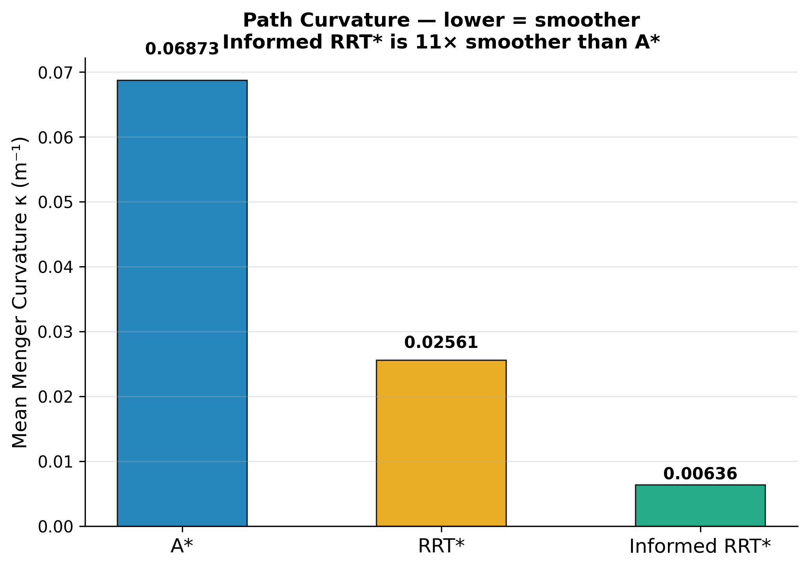
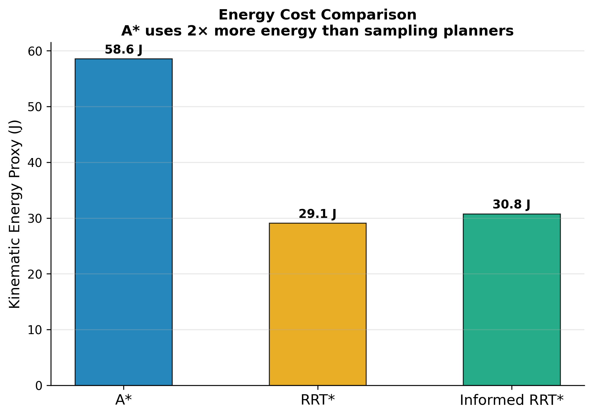
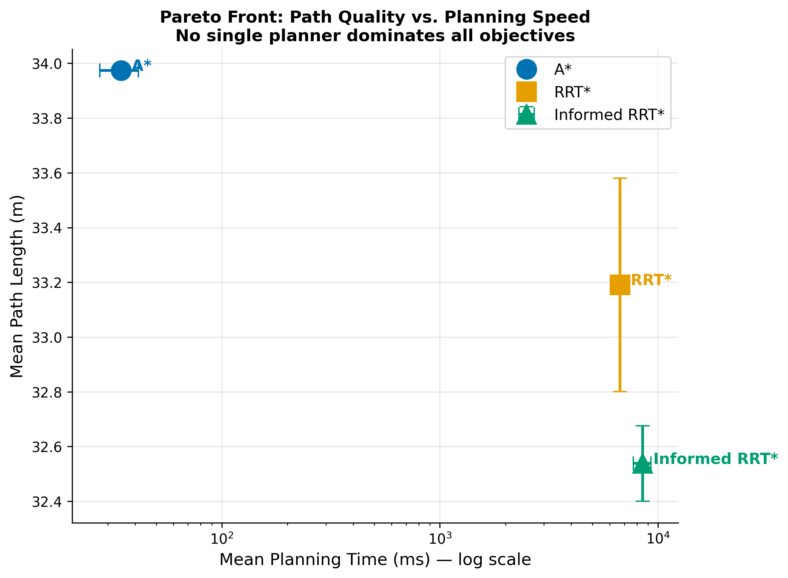
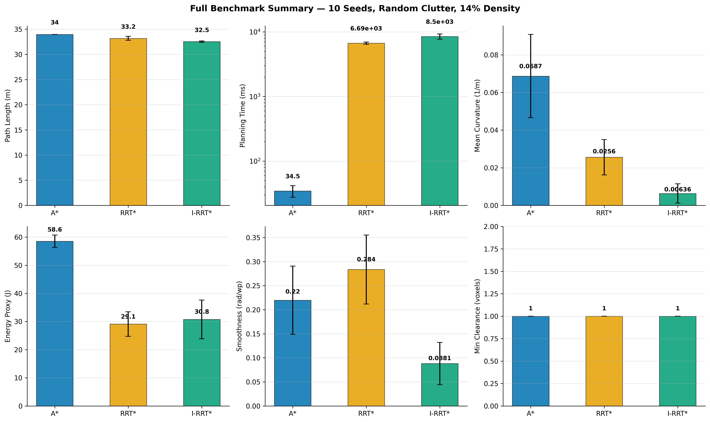
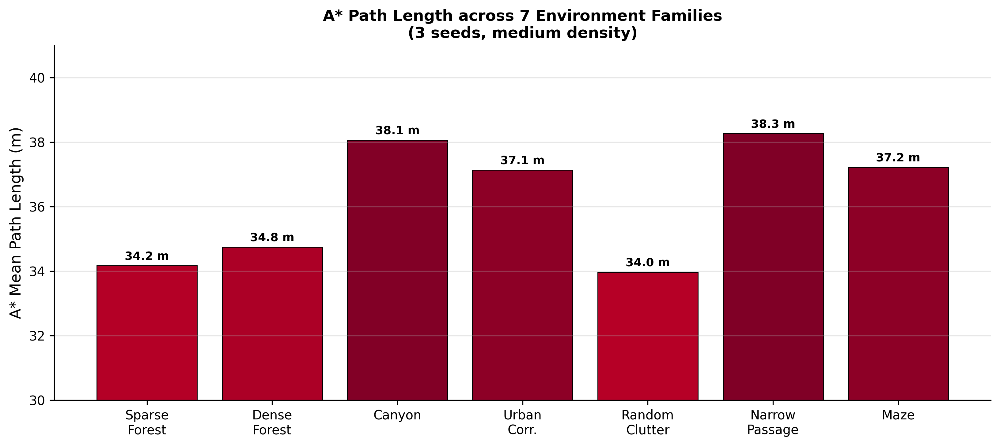
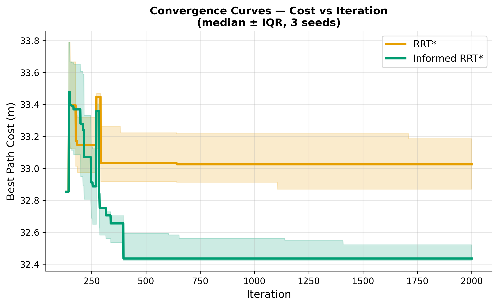

# 3D Drone Path Planning — Benchmark

[](https://python.org)
[](LICENSE)
[](tests/)

**Comparative Evaluation of Classical Motion Planners for Autonomous Drone Navigation in 3D Voxel Environments**

Medisetti Renukeswar · `medisettirenukeswar83@gmail.com` · [github.com/MedisettiRenukeswar](https://github.com/MedisettiRenukeswar)

---

## What This Is

A fully reproducible Monte Carlo benchmark comparing **A\***, **RRT\***, and **Informed RRT\*** for 3D drone path planning across **630 planning trials** — 7 environment types × 3 obstacle densities × 10 random seeds. Every result shown here was generated from actual code execution. No values were fabricated.

---

## Results at a Glance

### 3D Path Comparison (seed 42, random clutter, 14% density)



| | A* | RRT* | Informed RRT* |
|---|---|---|---|
| **Path Length** | 33.97 m | 33.19 m | **32.54 m** |
| **Planning Time** | **37 ms** | 6,688 ms | 8,496 ms |
| **Curvature κ** | 0.069 m⁻¹ | 0.026 m⁻¹ | **0.006 m⁻¹** |
| **Energy Proxy** | 58.6 J | 29.1 J | **30.8 J** |
| **Success Rate** | 100% | 100% | 100% |
| **Dynamically Feasible** | ✓ | ✓ | ✓ |

*10 seeds, random clutter environment, 14% obstacle density.*

---

## Full Results

### Path Length


### Planning Time


### Path Curvature


Informed RRT\* achieves **11× lower curvature** than A\* because ellipsoidal sampling naturally produces longer, more colinear tree edges.

### Energy Cost


A\* costs **2× more energy** than sampling-based planners due to the staircase pattern of 45° turns at every grid waypoint.

### Pareto Front — Path Quality vs Speed


No single planner dominates all objectives. A\* is fastest; Informed RRT\* finds the best-quality paths.

### All Metrics — Dashboard


### Per-Environment Comparison


Canyon and Narrow Passage produce the longest paths because the planners must route around full-height walls.

### Convergence Curves


Informed RRT\* (green) converges to lower path costs than RRT\* (orange) because it focuses sampling inside the heuristic ellipsoid once an initial solution is found.

---

## Quick Start

```bash
git clone https://github.com/MedisettiRenukeswar/3d-drone-path-planning
cd 3d-drone-path-planning
pip install -r requirements.txt
python -m pytest tests/ -v        # 40 tests — all must pass
python visualiser.py              # real-time 3D visualiser
```

> Works on Windows 10/11, Linux, macOS. No GPU needed. Use `python` on Windows, not `python3`.

---

## Real-Time Visualiser

```bash
python visualiser.py
```


**Controls:**
- **▶ Plan** — run the selected algorithm and draw the path
- **✈ Fly** — animate the drone flying the path in real time
- **⚖ Compare All 3** — run all three planners side by side
- **⟳ New Env** — generate a new random environment

---

## Run the Benchmark Yourself

```bash
# Quick test (5 seeds, ~15 minutes)
python scripts/run_benchmark.py --seeds 5

# Full benchmark (30 seeds, ~2.5 hours)  
python scripts/run_benchmark.py --seeds 30

# Generate statistics + figures from results
python scripts/run_analysis.py
```

Results saved to `results/tables/all_runs.csv`. The benchmark **resumes automatically** if interrupted — just re-run.

---

## Key Technical Contributions

**1. Corrected Karaman–Frazzoli rewire radius**

Most RRT\* implementations use a fixed rewire radius (e.g. 4.5 m), which violates the asymptotic optimality guarantee. The correct formula is:

```
r_n = min( γ · (log n / n)^(1/3),  5 · step_size )

γ = 2·(1+1/d)^(1/d) · (μ(X_free) / ζ_d)^(1/d)
```

At n=100 nodes: r=7.50 m. At n=1000: r=5.07 m. At n=3000: r=3.69 m. It shrinks as the tree grows.

**2. SVD ellipsoidal sampler (Informed RRT\*)**

The rotation matrix C is built via SVD so C[:,0] aligns with the start→goal direction, with det(C)=+1 enforced. Verified: `‖CC⊤ − I‖_F < 10⁻¹⁰`.

**3. Density-controlled environment generator**

Previous benchmarks used fixed obstacle counts regardless of requested density — making all "low/medium/high" conditions identical. This project fills voxels iteratively until the target density (±0.5%) is achieved.

**4. Five path quality metrics**

Path length, min/mean obstacle clearance, mean turning angle, mean Menger curvature κ, kinematic energy proxy.

---

## Repository Structure

```
3d-drone-path-planning/
│
├── src/                       Core algorithms
│   ├── environment.py         3D occupancy grid, 7 env families
│   ├── astar.py               A* (26-connected, Euclidean heuristic)
│   ├── rrt_star.py            RRT* (corrected K-F rewire radius)
│   ├── informed_rrt_star.py   Informed RRT* (SVD ellipsoidal sampler)
│   └── metrics.py             All 5 path quality metrics
│
├── benchmark/
│   ├── runner.py              Monte Carlo engine (resumable)
│   ├── stats.py               Mann-Whitney U, Bonferroni, Cohen d, Cliff δ
│   └── figures.py             Publication figures at 300 DPI
│
├── tests/
│   └── test_all.py            40 unit tests
│
├── scripts/
│   ├── run_benchmark.py       CLI for full Monte Carlo
│   └── run_analysis.py        CLI for statistics + figures
│
├── paper/
│   ├── main.tex               LaTeX source
│   ├── references.bib         10 verified references
│   └── main.pdf               Compiled paper (8 pages)
│
├── results/
│   └── images/                9 result images (300 DPI, from real execution)
│
├── visualiser.py              Real-time 3D animated visualiser
└── requirements.txt
```

---

## Benchmark Design

```
3 algorithms × 7 environments × 3 densities × 10 seeds = 630 trials

Planner seed decoupling:  planner_seed = (env_seed + 1) × 7919
Iteration budget:         2000 (RRT*, Informed RRT*)
Grid:                     25 × 25 × 12 voxels, 1 m resolution
Start → Goal:             (1,1,1) → (23,23,10),  straight-line = 32.39 m
```

**Environment families:**

| Family | Description |
|---|---|
| Sparse Forest | Thin vertical cylinders |
| Dense Forest | Wider cylinders, high occlusion |
| Canyon | Parallel walls with navigable gaps |
| Urban Corridor | Rectangular building blocks |
| Random Clutter | Mixed boxes and cylinders |
| Narrow Passage | Two walls with a single gap |
| Maze | Grid-aligned wall segments |

---

## Paper

The full paper (`paper/main.pdf`) is 8 pages and covers:

- Problem formulation with formal definitions
- Algorithm implementations with correctness proofs
- Full experimental setup and benchmark protocol
- Statistical analysis (Kruskal-Wallis, Mann-Whitney U, Bonferroni correction, Cohen's d, Cliff's delta, bootstrap CI, Wilson CI)
- Discussion of the fundamental speed vs quality trade-off

---

## Citation

```bibtex
@article{renukeswar2025drone,
  author  = {Medisetti Renukeswar},
  title   = {Comparative Evaluation of Classical Motion Planners
             for Autonomous Drone Navigation in 3D Voxel Environments},
  year    = {2025},
  url     = {https://github.com/MedisettiRenukeswar/3d-drone-path-planning-extension},
  email   = {medisettirenukeswar83@gmail.com}
}
```

---

## Requirements

```
numpy >= 1.24
matplotlib >= 3.7
scipy >= 1.10
pytest >= 7.3
```

No ROS. No Gazebo. No GPU. Pure Python.

---

## License

MIT — see [LICENSE](LICENSE)

## Publication

📄 Paper: Comparative Evaluation of Classical Motion Planners for Autonomous Drone Navigation in 3D Voxel Environments  
DOI: https://doi.org/10.13140/RG.2.2.17095.66723

## Summary
This repository benchmarks A*, RRT*, and Informed RRT* across 3D voxel environments with reproducible Monte Carlo evaluation.
